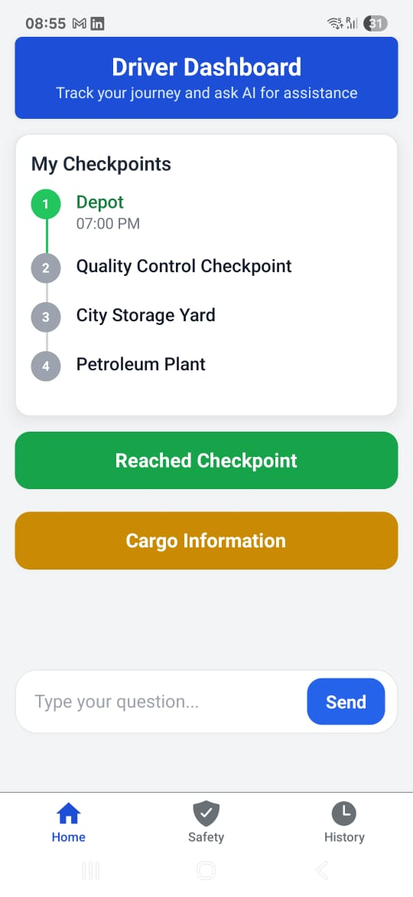

# Driver Companion App (Mobile)

A **React Native + Firebase powered app** for truck drivers to manage cargo, update checkpoints, and raise safety alerts.  
Seamlessly connected with the web dashboard, the app keeps logistics operations smooth and transparent.

---

## Features

### Cargo Management
- View assigned cargo information.
- Check delivery details and instructions.
- AI assistant for **cargo-related queries**.

###  Checkpoint Tracking
- Update status when reaching checkpoints (A → B → C).
- Real-time sync with the web dashboard.
- Offline support with **local caching** (updates synced when online).

###  Safety Alerts
- Raise safety concerns (equipment issues, road hazards, emergencies).
- Alerts instantly visible on the dashboard.
- Push notifications for urgent cases.

###  Driver AI Assistant
- Local AI model for Q&A about cargo and routes.
- Cached prompts for quick offline use.
- Ask about cargo details without navigating menus.

---

## Related Project: Website Dashboard
This app is tightly integrated with the [**Logistics Intelligence Dashboard**](https://github.com/VinayN3gi/checkpoint.git).  
The dashboard allows admins and managers to:
- Upload data and build custom dashboards
- Track driver progress and locations
- Monitor safety concerns in real-time
- Ask AI-powered questions on logistics data

All driver updates made in this app are instantly visible in the dashboard.

---

## Screenshots

---

## Tech Stack
- **Framework:** React Native (Expo / bare workflow supported)
- **Backend:** Firebase (Auth, Firestore, Notifications)
- **AI:** Local model + caching for prompts
- **Navigation:** React Navigation
- **UI:** TailwindCSS (NativeWind)
